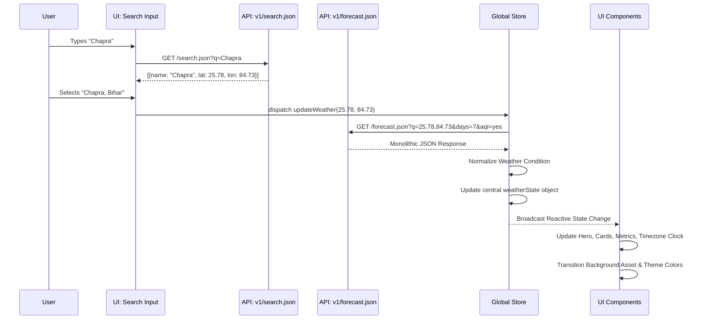

# Weather API Mapping & Architecture Contract

This document serves as the permanent contract between WeatherAPI.com and the Aether UI components. It defines exactly where every data point originates, how it is normalized, and how failures are handled.

---

## SECTION 1: API SELECTION ANALYSIS

### 1. Search / Geocoding Endpoint
- **Endpoint**: `v1/search.json`
- **Purpose**: Resolves user text input into specific, selectable geographic locations.
- **Returned Data**: Array of locations with `id`, `name`, `region`, `country`, `lat`, `lon`, and `url`.
- **Usage in Aether**: Powers the search autocomplete dropdown in the top App Bar and Sidebar footer.
- **Dependencies**: User input query string.

### 2. Forecast Endpoint (Primary Data Payload)
- **Endpoint**: `v1/forecast.json` (with `days=7`, `aqi=yes`, `alerts=yes`)
- **Purpose**: Serves as the monolithic data payload for 90% of the dashboard, significantly reducing HTTP requests.
- **Returned Data**: `location`, `current`, `forecast` (hourly and daily arrays), `air_quality`, `astro`, and `alerts`.
- **Usage in Aether**: Hero Section, Hourly/Daily Cards, Metric Strip, Sidebar Summary.
- **Dependencies**: Target `lat/lon` or valid `q` query.

### 3. Air Quality Endpoint
- **Endpoint**: Fetched via `aqi=yes` flag on `forecast.json` (or `v1/current.json`).
- **Purpose**: Provides EPA and Defra index data.
- **Returned Data**: `air_quality` object containing `co`, `no2`, `o3`, `so2`, `pm2_5`, `pm10`, and `us-epa-index`.
- **Usage in Aether**: Powers the AQI Card, Circular Gauge, and Health Advisories.

### 4. Astronomy Endpoint
- **Endpoint**: Fetched via `astro` object inside `forecast.json` days array.
- **Purpose**: Provides sun and moon data for the target location.
- **Returned Data**: `sunrise`, `sunset`, `moonrise`, `moonset`, `moon_phase`, `moon_illumination`.
- **Usage in Aether**: Powers Sunrise, Sunset, and Moon Phase blocks in the Weather Metrics Strip.

---

## SECTION 2: COMPLETE COMPONENT MAPPING

### Hero Section
| Displayed Value | WeatherAPI JSON Path | Fallback Value | Update Trigger |
| :--- | :--- | :--- | :--- |
| Current Temperature | `current.temp_c` | `--°` | City Search / Interval |
| Feels Like | `current.feelslike_c` | `--°` | City Search / Interval |
| Weather Condition | `current.condition.text` | `Unknown` | City Search / Interval |
| Weather Icon | Mapped via `current.condition.code` | Default SVG | City Search / Interval |
| Location | `location.name` | `Unknown City` | City Search |
| Time | `location.localtime_epoch` | `--:--` | Clock Tick (Local to City) |
| Date | `location.localtime_epoch` | `--/--/--` | Clock Tick (Local to City) |
| Max Temp | `forecast.forecastday[0].day.maxtemp_c` | `--°` | City Search / Interval |
| Min Temp | `forecast.forecastday[0].day.mintemp_c` | `--°` | City Search / Interval |

### Today's Summary Card
| Displayed Value | WeatherAPI JSON Path | Fallback Value | Update Trigger |
| :--- | :--- | :--- | :--- |
| Current Condition | `current.condition.text` | `--` | City Search |
| Forecast Summary | Computed (e.g. "Rain for next 3 hours") | `No summary` | City Search |
| Rain Chance | `forecast.forecastday[0].day.daily_chance_of_rain` | `--%` | City Search |
| Wind Speed | `current.wind_kph` | `-- km/h` | City Search |
| UV Index | `current.uv` | `--` | City Search |
| Max Temp | `forecast.forecastday[0].day.maxtemp_c` | `--°` | City Search |
| Min Temp | `forecast.forecastday[0].day.mintemp_c` | `--°` | City Search |

### Hourly Forecast Card
| Displayed Value | WeatherAPI JSON Path | Fallback Value | Update Trigger |
| :--- | :--- | :--- | :--- |
| Hourly Time | `forecastday[0].hour[x].time_epoch` | `--` | City Search |
| Hourly Temp | `forecastday[0].hour[x].temp_c` | `--°` | City Search |
| Hourly Icon | Mapped via `hour[x].condition.code` | Default SVG | City Search |
| Hourly Rain Chance | `hour[x].chance_of_rain` | `--%` | City Search |
| Graph Data Source | Array of `hour[x].temp_c` | `[]` | City Search |

### Daily Forecast Card
| Displayed Value | WeatherAPI JSON Path | Fallback Value | Update Trigger |
| :--- | :--- | :--- | :--- |
| Day | `forecast.forecastday[x].date_epoch` | `--` | City Search |
| Date | `forecast.forecastday[x].date` | `--` | City Search |
| Weather Icon | Mapped via `forecastday[x].day.condition.code`| Default SVG | City Search |
| High Temp | `forecastday[x].day.maxtemp_c` | `--°` | City Search |
| Low Temp | `forecastday[x].day.mintemp_c` | `--°` | City Search |
| Rain Chance | `forecastday[x].day.daily_chance_of_rain` | `--%` | City Search |

### AQI Card
| Displayed Value | WeatherAPI JSON Path | Fallback Value | Update Trigger |
| :--- | :--- | :--- | :--- |
| AQI Score | Computed from pollutants or raw index | `--` | City Search |
| AQI Ring Value | `current.air_quality["us-epa-index"]` | `0` | City Search |
| AQI Status | Mapped from `us-epa-index` (1=Good...6=Hazardous)| `Unavailable` | City Search |
| Main Pollutant | Max calculated ratio of raw pollutants | `--` | City Search |
| Health Advisory | Mapped from AQI Status | `No data` | City Search |

### Weather Metrics Strip
| Displayed Value | WeatherAPI JSON Path | Fallback Value | Update Trigger |
| :--- | :--- | :--- | :--- |
| Humidity | `current.humidity` | `--%` | City Search |
| Wind Speed | `current.wind_kph` | `-- km/h` | City Search |
| Pressure | `current.pressure_mb` | `-- hPa` | City Search |
| Visibility | `current.vis_km` | `-- km` | City Search |
| Cloud Cover | `current.cloud` | `--%` | City Search |
| Dew Point | `current.dewpoint_c` | `--°` | City Search |
| UV Index | `current.uv` | `--` | City Search |
| Sunrise | `forecast.forecastday[0].astro.sunrise` | `--:--` | City Search |
| Sunset | `forecast.forecastday[0].astro.sunset` | `--:--` | City Search |
| Moon Phase | `forecast.forecastday[0].astro.moon_phase` | `--` | City Search |

### Sidebar Location Card
| Displayed Value | WeatherAPI JSON Path | Fallback Value | Update Trigger |
| :--- | :--- | :--- | :--- |
| City | `location.name` | `--` | City Search |
| Region | `location.region` | `--` | City Search |
| Country | `location.country` | `--` | City Search |
| Local Time | `location.localtime_epoch` | `--:--` | Clock Tick |
| Local Date | `location.localtime_epoch` | `--/--/--` | Clock Tick |
| Current Temp | `current.temp_c` | `--°` | City Search |
| Current Weather | `current.condition.text` | `--` | City Search |

---

## SECTION 3: WEATHER CONDITION NORMALIZATION

WeatherAPI returns highly specific strings and codes. To ensure the UI perfectly maps to the 8 approved aesthetic themes without missing edge cases, we mandate a normalization layer based on WeatherAPI condition codes.

| Raw Condition (WeatherAPI) | Normalized State (Aether) |
| :--- | :--- |
| Sunny, Clear | `Clear Day` / `Clear Night` |
| Partly cloudy | `Partly Cloudy` |
| Cloudy, Overcast | `Cloudy` |
| Mist, Fog, Freezing fog | `Fog` |
| Patchy rain possible, Light drizzle, Patchy light rain, Light rain, Moderate rain, Heavy rain, Torrential rain shower | `Rain` |
| Thundery outbreaks possible, Patchy light rain with thunder, Moderate or heavy rain with thunder | `Thunderstorm` |
| Patchy snow possible, Light snow, Moderate snow, Heavy snow, Blizzard, Ice pellets | `Snow` |

*Note: The normalization logic must use WeatherAPI's unique `code` integer for reliability rather than parsing the `text` field to avoid localization bugs.*

---

## SECTION 4: UPDATE FLOW



---

## SECTION 5: FAILURE STRATEGY

To ensure the dashboard remains functional whenever possible, the following degradation rules apply:

1. **Weather API Failure (Critical)**
   - **Loading State**: App-wide skeleton loaders.
   - **Error State**: Blur overlay with "Unable to fetch current weather."
   - **Fallback State**: Freeze on last known good state if available.
   - **Retry Strategy**: Exponential backoff (1s, 2s, 4s). Max 3 attempts.

2. **Missing AQI Payload (Non-Critical)**
   - **Condition**: `current.air_quality` is undefined in the monolithic JSON.
   - **Error State**: AQI Card displays "Data unavailable".
   - **Fallback State**: Empty circular gauge (`0` value).

3. **Missing Astronomy Payload (Non-Critical)**
   - **Condition**: `forecastday[x].astro` is undefined.
   - **Error State**: Metric Strip shows `--:--` for Sunrise/Sunset.
   - **Fallback State**: Default moon icon.

4. **Geocoding Failure**
   - **Error State**: Inline red text below search input: "Search service unavailable."
   - **Fallback State**: Search input remains active but displays no autocomplete results.

5. **No Results Found**
   - **Error State**: Dropdown displays "No locations found matching '...'"

6. **Rate Limit Exceeded**
   - **Error State**: Toast notification "Weather updates temporarily delayed (Rate Limit)."
   - **Fallback State**: System uses cached data.

7. **Network Offline**
   - **Error State**: Toast notification "You are currently offline."
   - **Fallback State**: Cache-first strategy for UI rendering.

---

## SECTION 6: TIMEZONE STRATEGY

Aether enforces strict target-city time rendering.

- **Target City Time & Date**: Derived from `location.tz_id` (e.g., `"Asia/Tokyo"`) and `location.localtime_epoch`.
- **Formatting Rules**: Must use `Intl.DateTimeFormat` configured explicitly with the `timeZone` parameter matching `location.tz_id`.
- **Display Rules**: The local device timezone (e.g., India Standard Time) is **completely ignored**. If a user in India searches Tokyo, the sidebar and hero sections will display Tokyo's local time and date.

---

## SECTION 7: UNIT SYSTEM STRATEGY

Version 1 is Metric-first, but the architecture must support dual unit consumption from day one.

- **Storage**: The Global Store will maintain a `units` preference (`"metric"` or `"imperial"`).
- **Consumption Strategy**: UI Components will utilize a getter/selector function `getTemperature()`.
- **Mapping**:
  - `getTemperature()` returns `temp_c` or `temp_f` based on state.
  - `getSpeed()` returns `wind_kph` or `wind_mph`.
  - `getPressure()` returns `pressure_mb` or `pressure_in`.
  - `getVisibility()` returns `vis_km` or `vis_miles`.

---

## SECTION 8: BACKGROUND SYSTEM CONTRACT

The UI completely decouples background rendering from raw API conditions.

1. **Input**: WeatherAPI `current.condition.code` is passed to the Normalizer.
2. **Output**: Normalizer returns a `Normalized State` ID (e.g., `thunderstorm`).
3. **Contract**: The Background Component subscribes *only* to the Normalized State ID.
4. **Asset Dictionary**:
   ```javascript
   const themeAssets = {
     thunderstorm: {
       type: "image", // Future-proofed for "video" or "shader"
       src: "/assets/backgrounds/thunderstorm.webp",
       overlayClass: "bg-background/40",
       accentColor: "var(--color-primary)"
     }
   };
   ```
This strict contract ensures we can replace a static image with a `<video>` tag or WebGL Canvas in Phase 14 without touching the WeatherAPI fetching logic or the global state manager.
